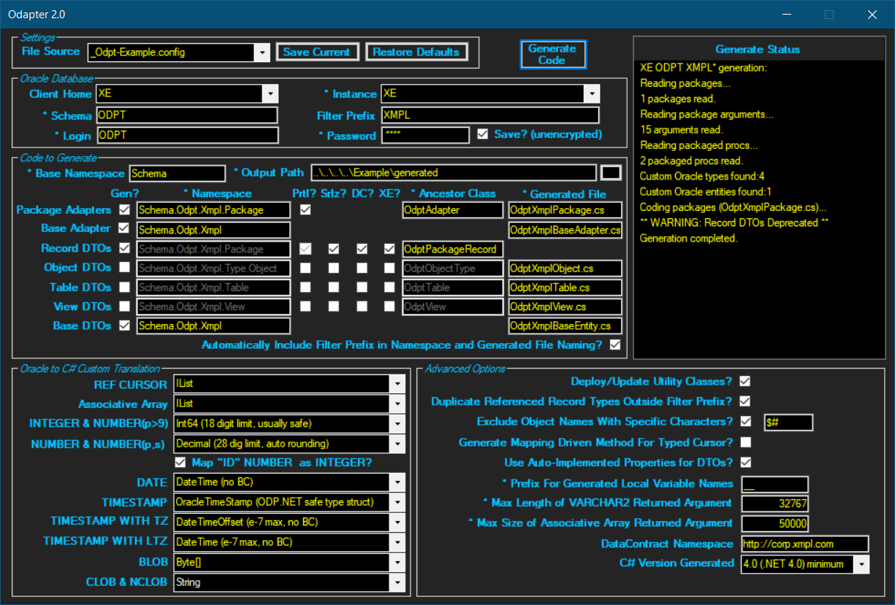

Odapter - a C# code generator for Oracle packages
========================================

Odapter generates C# adapter classes that provide maximum integration with an Oracle schema's packages. In addition to invoking packaged functions, generated DTO Lists will be hydrated from returned cursor results sets, both typed (record type based) and untyped (simple REF CURSOR). The generated C# provides de facto compile-time resolution with Oracle packages from within the IDE. Additionally, C# DTOs can be generated for object types, tables and views.

### Minimum System Requirements

* Oracle RDBMS 11g
* Windows 64-bit OS
* .NET Framework 
    - 4.0 minimum for code generator
    - 3.5 minimum for project
* ODP.NET for destination project
    - Managed Driver if targeting .NET Framework 4.0 or higher
    - Unmanaged Driver if targeting .NET Framework 3.5

### Oracle to C# Translation Examples

| PL/SQL and Schema Objects                           | C# |
| --------------------------------------------------- | -------- |
| Case insensitive                                    | Case senstive | 
| underscore_delimited naming                         | PascalCase & camelCase naming     |
| Package Record Type Field                           | Property     |
| Package Record Type                                 | Nested public class of properties    |
| Function or Stored Procedure (packaged)             | Method    |
| Package                                             | Singleton class of methods and nested classes    |
| Schema                                              | Namespace (with nesting)    |
| Object Type, Table, View                            | Class of properties    |

### Code Generation Features

* Generates adapter class for each package and nested DTO for each respective record type
* Translates all common Oracle data types to C#
* Translates Oracle associative array type to C# List of the associative array's value type
* Configurable translation of Oracle NUMBER, DATE and TIMESTAMP types to C# (including ODP.NET safe types OracleDecimal, OracleDate, OracleTimestamp)
* Translates Oracle IN, OUT and IN OUT parameters to C#
* Translates Oracle optional (defaulted) parameters to C# (4.0+)
* Translates typed and untyped cursors (both as function return and OUT parameters) to C#
* Generates DTO class for each object type, table, and view in
* Configurable for either auto-implemented, or protected field wrapped, DTO properties
* Generates ancestor classes and basic schema connection code
* Configurable C# namespaces and base class names
* Generates post hook for profiling a package procedure invoked from C#
* Optionally filters schema objects via prefix and/or special characters
* Optionally generates C# classes as partial for packages, package record types, object types, tables and views
* Optionally generates C# DTOs with Serializable, DataContract/DataMember (incl. namespace) or XmlElementAttribute attributes for package record types, object types, tables and views
* Generates C# 3.0 or 4.0+ code (respectively .NET 3.5 or 4.0+)
* Generates single C# file for all packages, object types, tables and views, respectively
* Handles package referencing a record type defined in a diffferent package (including filtered)
* Easily adaptable to legacy .NET projects and Oracle schemas
* Locates and parses local TNSNAMES.ORA for Oracle instances
* Persists custom generation settings to config file for multiple projects or schemas

### Run Time Features - Packages

* Invokes packaged functions and stored procedures
* Hydrates a List of (record type derived) DTOs from a returned (incl. OUT param) typed cursor result set
* Hydrates a List of DTOs from a returned untyped cursor result set using configurable mapping:
    - Mapping by name: column name to property name (translates underscore_delimited to PascalCase)
    - Mapping by position: column position to property attribute position (unmapped column silent fail option)
    - For performance, uses thread-safe static cache for mappings of C# DTO to Oracle result set
* Constructs (from underlying columns) and hydrates DataTable from returned typed or untyped cursor result set
* Optionally limits the number of rows returned from any cursor result set

### Getting Started: Generating Code for Packages

1. Download Odapter/bin/x64/Release/Odapter.exe and run
2. If Oracle Client Homes are found, select appropriate value
3. Select Instance (If TNSNAMES.ORA file is not found/parsed in Step 2, Instance can be entered)
4. Enter Schema, Login and Password
5. If your project uses only a prefixed subset of the schema's packages, enter Filter Prefix value
6. Enter the Output Path for all generated files (your project folder)
7. If your project is using the .NET 3.5 framework, select 3.0 as the C# Version
8. For all other fields, use default settings
9. Click Generate 
10. After successful generation, enter a project based .config file name in File Source and click Save Current
11. Open your project and add the generated files
12. Add "using Schema.YourSchemaName.YourFilterPrefixIfAny.Package" to project files in order to access packages
13. See Tester/Tester.cs and code below for examples

### Code Example
###### Package Specification - Tester/schema/package/odpt_pkg_example.pks

```SQLPL
CREATE OR REPLACE PACKAGE ODPT.xmpl_pkg_example AS

    -- assoc array of integers
    TYPE t_assocarray_integer IS TABLE OF INTEGER INDEX BY PLS_INTEGER;  

    -- typed cursor
    TYPE t_table_big_partial IS RECORD (
        id                  odpt_table_big.id%TYPE,                 -- NUMBER
        col_integer         odpt_table_big.col_integer%TYPE,        -- INTEGER
        col_number          odpt_table_big.col_number%TYPE,         -- NUMBER
        col_varchar2_max    odpt_table_big.col_varchar2_max%TYPE,   -- VARCHAR2(4000)
        col_date            odpt_table_big.col_date%TYPE,           -- DATE
        col_timestamp       odpt_table_big.col_timestamp%TYPE);     -- TIMESTAMP
    TYPE t_ref_cursor_table_big_partial IS REF CURSOR RETURN t_table_big_partial;
	
    -- untyped cursor 
    TYPE t_ref_cursor IS REF CURSOR;
    
    FUNCTION get_rows_typed_ret (p_in_number IN NUMBER, p_in_out_varchar2 IN OUT VARCHAR2, p_in_out_assocarray_integer IN OUT t_assocarray_integer, 
        p_out_date OUT DATE) RETURN t_ref_cursor_table_big_partial;
    FUNCTION get_rows_untyped_ret (p_in_integer IN INTEGER) RETURN t_ref_cursor;
    
END xmpl_pkg_example;
/
```

###### Package Body  - Tester/schema/package/xmpl_pkg_example.pkb

```SQLPL
CREATE OR REPLACE PACKAGE BODY ODPT.xmpl_pkg_example AS
                                     
    FUNCTION get_rows_typed_ret (p_in_number IN NUMBER, p_in_out_varchar2 IN OUT VARCHAR2, p_in_out_assocarray_integer IN OUT t_assocarray_integer, 
            p_out_date OUT DATE) RETURN t_ref_cursor_table_big_partial IS
        l_cursor    t_ref_cursor_table_big_partial;
        l_idx		INTEGER;        
    BEGIN
        OPEN l_cursor FOR
        SELECT      id, col_integer, col_number, col_varchar2_max, col_date, col_timestamp
        FROM        odpt_table_big
        ORDER BY    id;    

        -- multiply each value in assoc array by 7 before returning
        l_idx := p_in_out_assocarray_integer.FIRST;
        WHILE l_idx IS NOT NULL LOOP
            p_in_out_assocarray_integer(l_idx) := p_in_out_assocarray_integer(l_idx) * 7;
            l_idx := p_in_out_assocarray_integer.NEXT(l_idx);
        END LOOP;
        
        p_in_out_varchar2 := 'Goodbye';        
        p_out_date := TO_DATE ('31-DEC-1999');        
        RETURN l_cursor;
    END;	

    FUNCTION get_rows_untyped_ret (p_in_integer IN INTEGER) RETURN t_ref_cursor IS
        l_cursor    t_ref_cursor;
    BEGIN    
        OPEN l_cursor FOR
        SELECT      id, col_integer, col_number, col_varchar2_max, col_date, col_timestamp
        FROM        odpt_table_big
        ORDER BY    id;    

        RETURN l_cursor;
    END;	
    
END xmpl_pkg_example;
/
```

###### Generation 



###### Generated Code - Tester/generated/OdptXmplPackage.cs

```C#
//------------------------------------------------------------------------------
// <auto-generated>
//     This code was auto-generated by Odapter on Sun, 03 Jun 2018 01:45:10 GMT.
//     Direct edits will be lost if the code is regenerated.
// </auto-generated>
//------------------------------------------------------------------------------

using System;
using System.Collections.Generic;
using System.Data;
using System.Data.Common;
using Oracle.ManagedDataAccess.Client;
using Oracle.ManagedDataAccess.Types;
using System.Collections;
using System.Diagnostics;
using System.Runtime.Serialization;
using System.Xml;
using System.Xml.Serialization;
using System.Linq;
using Odapter;

namespace Schema.Odpt.Xmpl.Package {

    public partial class XmplPkgExample : Schema.Odpt.Xmpl.OdptAdapter {
        private XmplPkgExample() { }
        private static XmplPkgExample _instance = new XmplPkgExample();
        public static XmplPkgExample Instance { get { return _instance; } }

        public interface ITTableBigPartial {
            Int64? Id { get; set; }
            Int64? ColInteger { get; set; }
            Decimal? ColNumber { get; set; }
            String ColVarchar2Max { get; set; }
            DateTime? ColDate { get; set; }
            OracleTimeStamp? ColTimestamp { get; set; }
        } // ITTableBigPartial

        [DataContract(Namespace="http://odpt.business.com")][Serializable()]
        public partial class TTableBigPartial : Schema.Odpt.Xmpl.OdptPackageRecord, ITTableBigPartial {
            private Byte propertyToEnsuresPartialClassNamesAreUniqueAtCompileTime { get; set; }
            [DataMember(Order=0, IsRequired=false)][XmlElement(Order=0, IsNullable=true)]
            public virtual Int64? Id { get; set; }
            [DataMember(Order=1, IsRequired=false)][XmlElement(Order=1, IsNullable=true)]
            public virtual Int64? ColInteger { get; set; }
            [DataMember(Order=2, IsRequired=false)][XmlElement(Order=2, IsNullable=true)]
            public virtual Decimal? ColNumber { get; set; }
            [DataMember(Order=3, IsRequired=false)][XmlElement(Order=3, IsNullable=true)]
            public virtual String ColVarchar2Max { get; set; }
            [DataMember(Order=4, IsRequired=false)][XmlElement(Order=4, IsNullable=true)]
            public virtual DateTime? ColDate { get; set; }
            [DataMember(Order=5, IsRequired=false)][XmlElement(Order=5, IsNullable=true)]
            public virtual OracleTimeStamp? ColTimestamp { get; set; }
        } // TTableBigPartial

        public List<T_TTableBigPartial> ReadResultITTableBigPartial<T_TTableBigPartial>(OracleDataReader rdr, UInt32? optionalMaxNumberRowsToReadFromAnyCursor = null)
                where T_TTableBigPartial : class, ITTableBigPartial, new()   {
            List<T_TTableBigPartial> __ret = new List<T_TTableBigPartial>();
            if (rdr != null && rdr.HasRows) {
                while (rdr.Read()) {
                    T_TTableBigPartial obj = new T_TTableBigPartial();
                    if (!rdr.IsDBNull(0)) obj.Id = Convert.ToInt64(rdr.GetValue(0));
                    if (!rdr.IsDBNull(1)) obj.ColInteger = Convert.ToInt64(rdr.GetValue(1));
                    if (!rdr.IsDBNull(2)) obj.ColNumber = (Decimal?)OracleDecimal.SetPrecision(rdr.GetOracleDecimal(2), 29);
                    if (!rdr.IsDBNull(3)) obj.ColVarchar2Max = Convert.ToString(rdr.GetValue(3));
                    if (!rdr.IsDBNull(4)) obj.ColDate = Convert.ToDateTime(rdr.GetValue(4));
                    if (!rdr.IsDBNull(5)) obj.ColTimestamp = (OracleTimeStamp?)rdr.GetOracleValue(5);
                    __ret.Add(obj);
                    if (optionalMaxNumberRowsToReadFromAnyCursor != null && __ret.Count >= optionalMaxNumberRowsToReadFromAnyCursor) break;
                }
            }
            return __ret;
        } // ReadResultITTableBigPartial

        public List<T_TTableBigPartial> GetRowsTypedRet<T_TTableBigPartial>(Decimal? pInNumber, ref String pInOutVarchar2, ref List<Int64?> pInOutAssocarrayInteger, out DateTime? pOutDate, 
                UInt32? optionalMaxNumberRowsToReadFromAnyCursor = null, OracleConnection optionalPreexistingOpenConnection = null)
                where T_TTableBigPartial : class, ITTableBigPartial, new() {
            List<T_TTableBigPartial> __ret = new List<T_TTableBigPartial>(); pOutDate = null; 
            OracleConnection __conn = optionalPreexistingOpenConnection ?? GetConnection();
            try {
                using (OracleCommand __cmd = new OracleCommand("ODPT.XMPL_PKG_EXAMPLE.GET_ROWS_TYPED_RET", __conn)) {
                    __cmd.CommandType = CommandType.StoredProcedure;
                    __cmd.BindByName = true;
                    __cmd.Parameters.Add(new OracleParameter("!RETURN", OracleDbType.RefCursor, null, ParameterDirection.ReturnValue));
                    __cmd.Parameters.Add(new OracleParameter("P_IN_NUMBER", OracleDbType.Decimal, pInNumber, ParameterDirection.Input));
                    __cmd.Parameters.Add(new OracleParameter("P_IN_OUT_VARCHAR2", OracleDbType.Varchar2, 32767, pInOutVarchar2, ParameterDirection.InputOutput));

                    __cmd.Parameters.Add(new OracleParameter("P_IN_OUT_ASSOCARRAY_INTEGER", OracleDbType.Int64, 1000, null, ParameterDirection.InputOutput));
                    __cmd.Parameters["P_IN_OUT_ASSOCARRAY_INTEGER"].Value = (pInOutAssocarrayInteger == null || pInOutAssocarrayInteger.Count == 0 ? new Int64?[]{} : pInOutAssocarrayInteger.ToArray());
                    __cmd.Parameters["P_IN_OUT_ASSOCARRAY_INTEGER"].CollectionType = OracleCollectionType.PLSQLAssociativeArray;
                    __cmd.Parameters.Add(new OracleParameter("P_OUT_DATE", OracleDbType.Date, null, ParameterDirection.Output));

                    OracleCommandTrace __cmdTrace = IsTracing(__cmd) ? new OracleCommandTrace(__cmd) : null;
                    int __rowsAffected = __cmd.ExecuteNonQuery();
                    if (!((OracleRefCursor)__cmd.Parameters["!RETURN"].Value).IsNull)
                        using (OracleDataReader __rdr = ((OracleRefCursor)__cmd.Parameters["!RETURN"].Value).GetDataReader()) {
                            __ret = ReadResultITTableBigPartial<T_TTableBigPartial>(__rdr, optionalMaxNumberRowsToReadFromAnyCursor);
                        } // using OracleDataReader
                    pInOutVarchar2 = __cmd.Parameters["P_IN_OUT_VARCHAR2"].Status == OracleParameterStatus.NullFetched
                        ? (String)null
                        : Convert.ToString(__cmd.Parameters["P_IN_OUT_VARCHAR2"].Value.ToString());

                    pInOutAssocarrayInteger = new List<Int64?>();
                    for (int _i = 0; _i < (__cmd.Parameters["P_IN_OUT_ASSOCARRAY_INTEGER"].Value as OracleDecimal[]).Length; _i++)
                        pInOutAssocarrayInteger.Add((__cmd.Parameters["P_IN_OUT_ASSOCARRAY_INTEGER"].Value as OracleDecimal[])[_i].IsNull
                            ? (Int64?)null 
                            : Convert.ToInt64(((__cmd.Parameters["P_IN_OUT_ASSOCARRAY_INTEGER"].Value as OracleDecimal[])[_i].ToString())));

                    pOutDate = __cmd.Parameters["P_OUT_DATE"].Status == OracleParameterStatus.NullFetched
                        ? (DateTime?)null
                        : Convert.ToDateTime(__cmd.Parameters["P_OUT_DATE"].Value.ToString());
                    if (__cmdTrace != null) TraceCompletion(__cmdTrace, __ret.Count);
                } // using OracleCommand
            } finally {
                if (optionalPreexistingOpenConnection == null) {
                    __conn.Close();
                    __conn.Dispose();
                }
            }
            return __ret;
        } // GetRowsTypedRet

        public List<T_returnUntyped> GetRowsUntypedRet<T_returnUntyped>(Int64? pInInteger, 
                bool mapColumnToObjectPropertyByPosition = false, bool allowUnmappedColumnsToBeExcluded = false, UInt32? optionalMaxNumberRowsToReadFromAnyCursor = null, 
                OracleConnection optionalPreexistingOpenConnection = null)
                where T_returnUntyped : class, new() {
            List<T_returnUntyped> __ret = new List<T_returnUntyped>(); 
            OracleConnection __conn = optionalPreexistingOpenConnection ?? GetConnection();
            try {
                using (OracleCommand __cmd = new OracleCommand("ODPT.XMPL_PKG_EXAMPLE.GET_ROWS_UNTYPED_RET", __conn)) {
                    __cmd.CommandType = CommandType.StoredProcedure;
                    __cmd.BindByName = true;
                    __cmd.Parameters.Add(new OracleParameter("!RETURN", OracleDbType.RefCursor, null, ParameterDirection.ReturnValue));
                    __cmd.Parameters.Add(new OracleParameter("P_IN_INTEGER", OracleDbType.Int64, pInInteger, ParameterDirection.Input));

                    OracleCommandTrace __cmdTrace = IsTracing(__cmd) ? new OracleCommandTrace(__cmd) : null;
                    int __rowsAffected = __cmd.ExecuteNonQuery();
                    if (!((OracleRefCursor)__cmd.Parameters["!RETURN"].Value).IsNull)
                        using (OracleDataReader __rdr = ((OracleRefCursor)__cmd.Parameters["!RETURN"].Value).GetDataReader()) {
                            __ret = Hydrator.ReadResult<T_returnUntyped>(__rdr, mapColumnToObjectPropertyByPosition, allowUnmappedColumnsToBeExcluded, optionalMaxNumberRowsToReadFromAnyCursor);
                        } // using OracleDataReader
                    if (__cmdTrace != null) TraceCompletion(__cmdTrace, __ret.Count);
                } // using OracleCommand
            } finally {
                if (optionalPreexistingOpenConnection == null) {
                    __conn.Close();
                    __conn.Dispose();
                }
            }
            return __ret;
        } // GetRowsUntypedRet

        public DataTable GetRowsUntypedRet(Int64? pInInteger, Boolean convertColumnNameToTitleCaseInCaption = false, UInt32? optionalMaxNumberRowsToReadFromAnyCursor = null, OracleConnection optionalPreexistingOpenConnection = null) {
            DataTable __ret = null; 
            OracleConnection __conn = optionalPreexistingOpenConnection ?? GetConnection();
            try {
                using (OracleCommand __cmd = new OracleCommand("ODPT.XMPL_PKG_EXAMPLE.GET_ROWS_UNTYPED_RET", __conn)) {
                    __cmd.CommandType = CommandType.StoredProcedure;
                    __cmd.BindByName = true;
                    __cmd.Parameters.Add(new OracleParameter("!RETURN", OracleDbType.RefCursor, null, ParameterDirection.ReturnValue));
                    __cmd.Parameters.Add(new OracleParameter("P_IN_INTEGER", OracleDbType.Int64, pInInteger, ParameterDirection.Input));

                    OracleCommandTrace __cmdTrace = IsTracing(__cmd) ? new OracleCommandTrace(__cmd) : null;
                    int __rowsAffected = __cmd.ExecuteNonQuery();
                    if (!((OracleRefCursor)__cmd.Parameters["!RETURN"].Value).IsNull)
                        using (OracleDataReader __rdr = ((OracleRefCursor)__cmd.Parameters["!RETURN"].Value).GetDataReader()) {
                            __ret = Hydrator.ReadResult(__rdr, convertColumnNameToTitleCaseInCaption, optionalMaxNumberRowsToReadFromAnyCursor);
                        } // using OracleDataReader
                    if (__cmdTrace != null) TraceCompletion(__cmdTrace, __ret.Rows.Count);
                } // using OracleCommand
            } finally {
                if (optionalPreexistingOpenConnection == null) {
                    __conn.Close();
                    __conn.Dispose();
                }
            }
            return __ret;
        } // GetRowsUntypedRet
    } // XmplPkgExample
} // Schema.Odpt.Xmpl.Package
```

###### Executing Generated Code - Example/Example.cs

```C#
using System;
using System.Collections.Generic;
using System.Linq;
using System.Text;
using System.Threading.Tasks;
using System.Data;
using System.Diagnostics;
using Oracle.ManagedDataAccess.Client;  // .NET 4.0 required
using Oracle.ManagedDataAccess.Types;   // .NET 4.0 required
using Schema.Odpt.Xmpl.Package;         // access to generated code for packages

namespace Odapter.Example {
    class Program {
        static void Main(string[] args) {
            Example example = new Example();
            example.Run();
        }
    }

    public class Example {
        private const String HELLO = "Hello", GOODBYE = "Goodbye";

        public void Run() {
            (new Odapter.Example.Example()).Test();
        }

        // class derived from record type DTO package
        private class MyClassDerived : XmplPkgExample.TTableBigPartial {
            public String StringPropertyExtra { get; set; }    // custom property
            public List<Int32> Int32ListPropertyExtra { get; set; } // custom property
        }

        // custom class to map only 4 columns; properties for Date and Timestap columns are excluded
        private class MyClassOriginal {
            public Int64? Id { get; set; }                          // maps to id column
            public Int64? ColInteger { get; set; }                  // maps to col_integer column
            public Decimal? ColNumber { get; set; }                 // maps to col_number column
            public String ColVarchar2Max { get; set; }              // maps to col_varchar2_max column
            public String StringPropertyExtra { get; set; }         // custom property
            public List<Int32> Int32ListPropertyExtra { get; set; } // custom property
        }

        public void Test() {
            uint? rowLimit = 25;
            Int64? pInInt64 = 100000000000000000;
            Decimal? pInDecimal = 10.0M;
            String pInOutString = HELLO;
            DateTime? pOutDate;
            List<Int64?> pInOutListInt64 = new List<Int64?> { 2, 3, 5, 7, 11, 13, 17, 19, 29, 31 }, pInOutListInt64Copy = pInOutListInt64;

            // hydrate DTO List from typed result set
            List<MyClassDerived> myClassDerivedList = XmplPkgExample.Instance.GetRowsTypedRet<MyClassDerived>(pInDecimal, ref pInOutString, ref pInOutListInt64, out pOutDate, rowLimit);
            Debug.Assert(pInOutString.Equals(GOODBYE));                                 // confirm OUT arg from package function
            for (int i = 0; i < pInOutListInt64.Count; i++)
                Debug.Assert(pInOutListInt64[i].Equals(pInOutListInt64Copy[i] * 7));    // confirm all values were multiplied by 7 in func
            Debug.Assert(pOutDate.Equals(new DateTime(1999, 12, 31)));                  // confirm OUT arg from package function
            Debug.Assert(myClassDerivedList.Count == rowLimit);

            // hydrate DTO List from untyped result set by mapping column name to property name (default); force unmapped columns to be ignored (non-default)
            List<MyClassOriginal> myClassOriginalList = XmplPkgExample.Instance.GetRowsUntypedRet<MyClassOriginal>(pInInt64, false, true, rowLimit);
            Debug.Assert(myClassOriginalList.Count == rowLimit);

            // hydrate Datatable from all columns in untyped result set; convert column names to DataTable captions
            DataTable myDataTable = XmplPkgExample.Instance.GetRowsUntypedRet(pInInt64, true, rowLimit);
            List<String> dataTableCaptions = new List<string> { "Id", "Col Integer", "Col Number", "Col Varchar2 Max", "Col Date", "Col Timestamp" };
            for (int i = 0; i < dataTableCaptions.Count; i++)
                Debug.Assert(myDataTable.Columns[i].Caption.Equals(dataTableCaptions[i]));  // confirm captions were created from column name
            Debug.Assert(myDataTable.Rows.Count == rowLimit);
        }
    }
}
```
