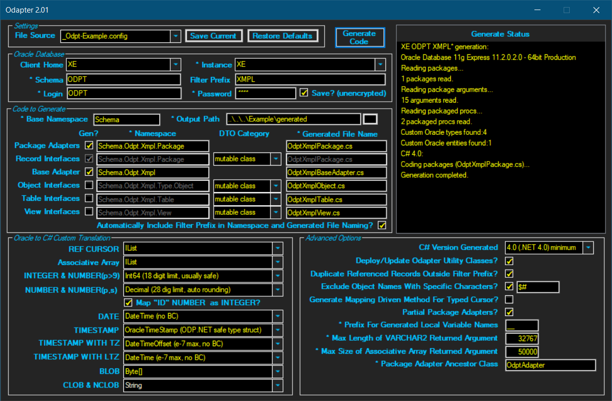
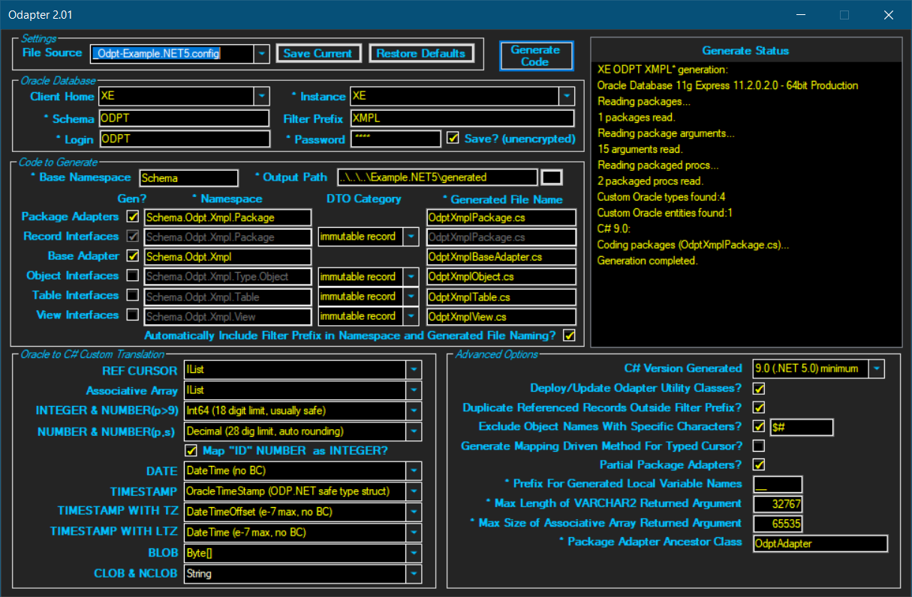

Odapter - a C# code generator for Oracle packages
========================================

Odapter is a [single-file desktop application](/OdapterWnFrm/bin/Release) that generates C# adapter classes to provide integration with Oracle packages. An adapter class handles the invocation of a package's procedures and the hydration of interface implementing DTO collections from returned cursor results sets, both typed (record based) and untyped (simple REF CURSOR). From within the IDE, the generated C# provides the developer de facto compile-time resolution with the packages. Optionally, standalone C# DTOs (class or record) can be generated from Oracle objects, tables and views. 

### Minimum System Requirements

* Oracle RDBMS 11g
* Windows 64-bit 
* .NET Versions
    - Generator application:    .NET 4.6.2 minimum 
    - Destination project:      .NET 4.0 (minimum) or .NET 5.0 (minimum)
* ODP.NET for destination project
    - .NET 4.x:     Managed Driver 12.2.x
    - .NET 5.0+:    Managed Driver Core (latest)

### Oracle to C# Translation Examples

| PL/SQL and Schema Objects                           | C# |
| --------------------------------------------------- | -------- |
| Case insensitive                                    | Case sensitive | 
| snake_case naming 		                          | PascalCase & camelCase naming     |
| Package Record Field                                | Property     |
| Package Record                                      | Interface of properties (mutable or immutable)    |
| Function or Stored Procedure (packaged)             | Method    |
| Package                                             | Singleton class of methods and interfaces    |
| Schema                                              | Namespace (with nesting)    |
| Object, Table, View                                 | Interface of properties (mutable or immutable)   |

### Code Generation Features

* Generates adapter class for each package with respective method for each procedure/function
* Generates nested interface for each package record as either:
    - mutable class
    - immutable record, including positional with parameterless constructor (C# 9.0 only)
* Translates all common Oracle data types to C#
* Configurable translation of Oracle REF CURSROR (typed and untyped) to IList, ICollection, or List
* Configurable translation of Oracle integer-indexed associative array type to IList or List of value type
* Configurable translation of Oracle INTEGER, NUMBER, DATE, TIMESTAMP types, including options for ODP.NET safe types (OracleDecimal, OracleDate, OracleTimestamp)
* Configurable translation of Oracle BLOB and CLOB/NCLOB types, including options for ODP.NET safe types (OracleBlob, OracleClob)
* Translates Oracle IN, OUT and IN OUT parameters to C#
* Translates Oracle optional (defaulted) parameters to C#
* Generates interface for each object, table, and view as either:
    - mutable class
    - immutable record, including positional with parameterless constructor (C# 9.0 only)
* Generates ancestor adapter class for customization
* Generates default database connection logic for customization
* Configurable C# namespaces, ancestor class names and file names
* Generates post hook for profiling a package procedure invoked from C#
* Optionally filters schema objects via prefix and/or special characters
* Optionally generates C# package adapter classes as partial 
* Generates C# 4.0 compatible code (.NET 4.0+) or C# 9.0 compatible code (.NET 5+)
* Generates single C# file for all packages, objects, tables and views, respectively
* Handles package referencing a record defined in a different package (including filtered)
* Easily adaptable to legacy .NET projects and Oracle schemas
* Locates and parses local TNSNAMES.ORA for Oracle instances
* Persists code generation settings to config file for handling multiple projects/schemas

### Run Time Features - Packages

* Invokes packaged functions and stored procedures
* Hydrates a List of (package record derived) DTOs from a returned (incl. OUT param) typed cursor result set
* Hydrates a List of DTOs from a returned untyped cursor result set using configurable mapping:
    - Mapping by name: column name to property name (snake_case column translated to public PascalCase property, or protected camelCase field or private underscore-prefixed camelCase field)
    - Mapping by position: column position to property position via HydratorMapAttribute attribute
    - For performance, uses thread-safe static cache for mappings of C# DTO to Oracle result set
* Constructs (from underlying columns) and hydrates DataTable from returned untyped cursor result set; captions are generated from column name or alias
* Optionally limits the number of rows returned from any cursor result set

### Getting Started: Generating Code for Packages

1. Download Odapter.exe from [OdapterWnFrm/bin/Release](/OdapterWnFrm/bin/Release) and run
2. If Oracle Client Homes are found, select appropriate value
3. Select Instance (If TNSNAMES.ORA file is not found/parsed in Step 2, Instance can be entered)
4. Enter Schema, Login and Password
5. If your project uses only a prefixed subset of the schema's packages, enter Filter Prefix value
6. Enter the Output Path for all generated files (your project folder)
7. Select either 4.0 or 9.0 for C# Version Generated
8. For all other fields, use default settings
9. Click Generate 
10. After successful generation, enter a project based .config file name in File Source and click Save Current
11. Open your project and add the generated files
12. Install the managed ODP.NET driver, OracleManagedDataAccess 12.2.x for C# 4.0 and OracleManagedDataAccess.Core latest for C# 9.0.
13. Add "using Schema.YourSchemaName.YourFilterPrefixIfAny.Package" to project files in order to access packages

For examples, see code below and [Tester.cs](/Tester).

### Code Example
###### Package Specification - Tester/schema/package/xmpl_pkg_example.pks

```SQLPL
CREATE OR REPLACE PACKAGE ODPT.xmpl_pkg_example AS

    -- assoc array of integers
    TYPE t_assocarray_integer IS TABLE OF INTEGER INDEX BY PLS_INTEGER;  

    -- typed cursor
    TYPE t_table_big_partial IS RECORD (
        id                  odpt_table_big.id%TYPE,                 -- NUMBER
        col_integer         odpt_table_big.col_integer%TYPE,        -- INTEGER
        col_number          odpt_table_big.col_number%TYPE,         -- NUMBER
        col_varchar2_max    odpt_table_big.col_varchar2_max%TYPE,   -- VARCHAR2(4000)
        col_date            odpt_table_big.col_date%TYPE,           -- DATE
        col_timestamp       odpt_table_big.col_timestamp%TYPE);     -- TIMESTAMP
    TYPE t_ref_cursor_table_big_partial IS REF CURSOR RETURN t_table_big_partial;
	
    -- untyped cursor 
    TYPE t_ref_cursor IS REF CURSOR;
    
    FUNCTION get_rows_typed_ret (p_in_number IN NUMBER, p_in_out_varchar2 IN OUT VARCHAR2, p_in_out_assocarray_integer IN OUT t_assocarray_integer, 
        p_out_date OUT DATE) RETURN t_ref_cursor_table_big_partial;
    FUNCTION get_rows_untyped_ret (p_in_integer IN INTEGER) RETURN t_ref_cursor;
    
END xmpl_pkg_example;
/
```

###### Package Body  - Tester/schema/package/xmpl_pkg_example.pkb

```SQLPL
CREATE OR REPLACE PACKAGE BODY ODPT.xmpl_pkg_example AS
                                     
    FUNCTION get_rows_typed_ret (p_in_number IN NUMBER, p_in_out_varchar2 IN OUT VARCHAR2, p_in_out_assocarray_integer IN OUT t_assocarray_integer, 
            p_out_date OUT DATE) RETURN t_ref_cursor_table_big_partial IS
        l_cursor    t_ref_cursor_table_big_partial;
        l_idx		INTEGER;        
    BEGIN
        OPEN l_cursor FOR
        SELECT      id, col_integer, col_number, col_varchar2_max, col_date, col_timestamp
        FROM        odpt_table_big
        ORDER BY    id;    

        -- multiply each value in assoc array by 7 before returning
        l_idx := p_in_out_assocarray_integer.FIRST;
        WHILE l_idx IS NOT NULL LOOP
            p_in_out_assocarray_integer(l_idx) := p_in_out_assocarray_integer(l_idx) * 7;
            l_idx := p_in_out_assocarray_integer.NEXT(l_idx);
        END LOOP;
        
        p_in_out_varchar2 := 'Goodbye';        
        p_out_date := TO_DATE ('31-DEC-1999');        
        RETURN l_cursor;
    END;	

    FUNCTION get_rows_untyped_ret (p_in_integer IN INTEGER) RETURN t_ref_cursor IS
        l_cursor    t_ref_cursor;
    BEGIN    
        OPEN l_cursor FOR
           'SELECT      id, col_integer, col_number, 
                        col_varchar2_max varchar2_max_col /* use alias to test DataTable caption */, 
                        col_date, col_timestamp 
            FROM        odpt_table_big
            ORDER BY    id';    

        RETURN l_cursor;
    END;	
    
END xmpl_pkg_example;
/
```

###### Generation for C# 4.0 



###### Generated C# 4.0 Code - Example/generated/OdptXmplPackage.cs

```C#
//------------------------------------------------------------------------------
// <auto-generated>
//     This code was auto-generated by Odapter 2.01 on Tue, 08 Jun 2021 20:19:04 GMT.
//     Direct edits will be lost if the code is regenerated.
// </auto-generated>
//------------------------------------------------------------------------------

using System;
using System.Collections.Generic;
using System.Data;
using System.Data.Common;
using Oracle.ManagedDataAccess.Client;
using Oracle.ManagedDataAccess.Types;
using System.Collections;
using System.Diagnostics;
using System.Runtime.Serialization;
using System.Xml;
using System.Xml.Serialization;
using System.Linq;
using Odapter;

namespace Schema.Odpt.Xmpl.Package {

    public sealed partial class XmplPkgExample : Schema.Odpt.Xmpl.OdptAdapter {
        private XmplPkgExample() { }
        private static readonly XmplPkgExample _instance = new XmplPkgExample();
        public static XmplPkgExample Instance { get { return _instance; } }

        public interface ITTableBigPartial {
            Int64? Id { set; }
            Int64? ColInteger { set; }
            Decimal? ColNumber { set; }
            String ColVarchar2Max { set; }
            DateTime? ColDate { set; }
            OracleTimeStamp? ColTimestamp { set; }
        } // ITTableBigPartial

        public IList<TypeITTableBigPartial> ReadResultITTableBigPartial<TypeITTableBigPartial>(OracleDataReader rdr, UInt32? optionalMaxNumberRowsToReadFromAnyCursor = null)
                where TypeITTableBigPartial : class, ITTableBigPartial, new() {
            IList<TypeITTableBigPartial> __ret = new List<TypeITTableBigPartial>();
            if (rdr != null && rdr.HasRows) {
                while (rdr.Read()) {
                    TypeITTableBigPartial obj = new TypeITTableBigPartial();
                    if (!rdr.IsDBNull(0)) obj.Id = Convert.ToInt64(rdr.GetValue(0));
                    if (!rdr.IsDBNull(1)) obj.ColInteger = Convert.ToInt64(rdr.GetValue(1));
                    if (!rdr.IsDBNull(2)) obj.ColNumber = (Decimal?)OracleDecimal.SetPrecision(rdr.GetOracleDecimal(2), 28);
                    if (!rdr.IsDBNull(3)) obj.ColVarchar2Max = Convert.ToString(rdr.GetValue(3));
                    if (!rdr.IsDBNull(4)) obj.ColDate = Convert.ToDateTime(rdr.GetValue(4));
                    if (!rdr.IsDBNull(5)) obj.ColTimestamp = (OracleTimeStamp?)rdr.GetOracleValue(5);
                    __ret.Add(obj);
                    if (optionalMaxNumberRowsToReadFromAnyCursor != null && __ret.Count >= optionalMaxNumberRowsToReadFromAnyCursor) break;
                }
            }
            return __ret;
        } // ReadResultITTableBigPartial

        public IList<TypeITTableBigPartial> GetRowsTypedRet<TypeITTableBigPartial>(Decimal? pInNumber, ref String pInOutVarchar2, ref IList<Int64?> pInOutAssocarrayInteger, out DateTime? pOutDate, 
                UInt32? optionalMaxNumberRowsToReadFromAnyCursor = null, OracleConnection optionalPreexistingOpenConnection = null)
                where TypeITTableBigPartial : class, ITTableBigPartial, new() {
            IList<TypeITTableBigPartial> __ret = new List<TypeITTableBigPartial>(); pOutDate = null; 
            OracleConnection __conn = optionalPreexistingOpenConnection ?? GetConnection();
            try {
                using (OracleCommand __cmd = new OracleCommand("ODPT.XMPL_PKG_EXAMPLE.GET_ROWS_TYPED_RET", __conn)) {
                    __cmd.CommandType = CommandType.StoredProcedure;
                    __cmd.BindByName = true;
                    __cmd.Parameters.Add(new OracleParameter("!RETURN", OracleDbType.RefCursor, null, ParameterDirection.ReturnValue));
                    __cmd.Parameters.Add(new OracleParameter("P_IN_NUMBER", OracleDbType.Decimal, pInNumber, ParameterDirection.Input));
                    __cmd.Parameters.Add(new OracleParameter("P_IN_OUT_VARCHAR2", OracleDbType.Varchar2, 32767, pInOutVarchar2, ParameterDirection.InputOutput));

                    __cmd.Parameters.Add(new OracleParameter("P_IN_OUT_ASSOCARRAY_INTEGER", OracleDbType.Int64, 50000, null, ParameterDirection.InputOutput));
                    __cmd.Parameters["P_IN_OUT_ASSOCARRAY_INTEGER"].Value = (pInOutAssocarrayInteger == null || pInOutAssocarrayInteger.Count == 0 ? new Int64?[]{} : pInOutAssocarrayInteger.ToArray());
                    __cmd.Parameters["P_IN_OUT_ASSOCARRAY_INTEGER"].CollectionType = OracleCollectionType.PLSQLAssociativeArray;
                    __cmd.Parameters.Add(new OracleParameter("P_OUT_DATE", OracleDbType.Date, null, ParameterDirection.Output));

                    OracleCommandTrace __cmdTrace = IsTracing(__cmd) ? new OracleCommandTrace(__cmd) : null;
                    int __rowsAffected = __cmd.ExecuteNonQuery();
                    if (!((OracleRefCursor)__cmd.Parameters["!RETURN"].Value).IsNull)
                        using (OracleDataReader __rdr = ((OracleRefCursor)__cmd.Parameters["!RETURN"].Value).GetDataReader()) {
                            __ret = ReadResultITTableBigPartial<TypeITTableBigPartial>(__rdr, optionalMaxNumberRowsToReadFromAnyCursor);
                        } // using OracleDataReader
                    pInOutVarchar2 = __cmd.Parameters["P_IN_OUT_VARCHAR2"].Status == OracleParameterStatus.NullFetched
                        ? (String)null
                        : Convert.ToString(__cmd.Parameters["P_IN_OUT_VARCHAR2"].Value.ToString());

                    pInOutAssocarrayInteger = new List<Int64?>();
                    for (int _i = 0; _i < (__cmd.Parameters["P_IN_OUT_ASSOCARRAY_INTEGER"].Value as OracleDecimal[]).Length; _i++)
                        pInOutAssocarrayInteger.Add((__cmd.Parameters["P_IN_OUT_ASSOCARRAY_INTEGER"].Value as OracleDecimal[])[_i].IsNull
                            ? (Int64?)null 
                            : Convert.ToInt64(((__cmd.Parameters["P_IN_OUT_ASSOCARRAY_INTEGER"].Value as OracleDecimal[])[_i].ToString())));

                    pOutDate = __cmd.Parameters["P_OUT_DATE"].Status == OracleParameterStatus.NullFetched
                        ? (DateTime?)null
                        : Convert.ToDateTime(__cmd.Parameters["P_OUT_DATE"].Value.ToString());
                    if (__cmdTrace != null) TraceCompletion(__cmdTrace, __ret.Count);
                } // using OracleCommand
            } finally {
                if (optionalPreexistingOpenConnection == null) {
                    __conn.Close();
                    __conn.Dispose();
                }
            }
            return __ret;
        } // GetRowsTypedRet

        public IList<TypeReturnUntyped> GetRowsUntypedRet<TypeReturnUntyped>(Int64? pInInteger, 
                bool mapColumnToObjectPropertyByPosition = false, bool allowUnmappedColumnsToBeExcluded = false, UInt32? optionalMaxNumberRowsToReadFromAnyCursor = null, 
                OracleConnection optionalPreexistingOpenConnection = null)
                where TypeReturnUntyped : class, new() {
            IList<TypeReturnUntyped> __ret = new List<TypeReturnUntyped>(); 
            OracleConnection __conn = optionalPreexistingOpenConnection ?? GetConnection();
            try {
                using (OracleCommand __cmd = new OracleCommand("ODPT.XMPL_PKG_EXAMPLE.GET_ROWS_UNTYPED_RET", __conn)) {
                    __cmd.CommandType = CommandType.StoredProcedure;
                    __cmd.BindByName = true;
                    __cmd.Parameters.Add(new OracleParameter("!RETURN", OracleDbType.RefCursor, null, ParameterDirection.ReturnValue));
                    __cmd.Parameters.Add(new OracleParameter("P_IN_INTEGER", OracleDbType.Int64, pInInteger, ParameterDirection.Input));

                    OracleCommandTrace __cmdTrace = IsTracing(__cmd) ? new OracleCommandTrace(__cmd) : null;
                    int __rowsAffected = __cmd.ExecuteNonQuery();
                    if (!((OracleRefCursor)__cmd.Parameters["!RETURN"].Value).IsNull)
                        using (OracleDataReader __rdr = ((OracleRefCursor)__cmd.Parameters["!RETURN"].Value).GetDataReader()) {
                            __ret = Hydrator.ReadResult<TypeReturnUntyped>(__rdr, mapColumnToObjectPropertyByPosition, allowUnmappedColumnsToBeExcluded, optionalMaxNumberRowsToReadFromAnyCursor);
                        } // using OracleDataReader
                    if (__cmdTrace != null) TraceCompletion(__cmdTrace, __ret.Count);
                } // using OracleCommand
            } finally {
                if (optionalPreexistingOpenConnection == null) {
                    __conn.Close();
                    __conn.Dispose();
                }
            }
            return __ret;
        } // GetRowsUntypedRet

        public DataTable GetRowsUntypedRet(Int64? pInInteger, Boolean convertColumnNameToTitleCaseInCaption = false, UInt32? optionalMaxNumberRowsToReadFromAnyCursor = null, OracleConnection optionalPreexistingOpenConnection = null) {
            DataTable __ret = null; 
            OracleConnection __conn = optionalPreexistingOpenConnection ?? GetConnection();
            try {
                using (OracleCommand __cmd = new OracleCommand("ODPT.XMPL_PKG_EXAMPLE.GET_ROWS_UNTYPED_RET", __conn)) {
                    __cmd.CommandType = CommandType.StoredProcedure;
                    __cmd.BindByName = true;
                    __cmd.Parameters.Add(new OracleParameter("!RETURN", OracleDbType.RefCursor, null, ParameterDirection.ReturnValue));
                    __cmd.Parameters.Add(new OracleParameter("P_IN_INTEGER", OracleDbType.Int64, pInInteger, ParameterDirection.Input));

                    OracleCommandTrace __cmdTrace = IsTracing(__cmd) ? new OracleCommandTrace(__cmd) : null;
                    int __rowsAffected = __cmd.ExecuteNonQuery();
                    if (!((OracleRefCursor)__cmd.Parameters["!RETURN"].Value).IsNull)
                        using (OracleDataReader __rdr = ((OracleRefCursor)__cmd.Parameters["!RETURN"].Value).GetDataReader()) {
                            __ret = Hydrator.ReadResult(__rdr, convertColumnNameToTitleCaseInCaption, optionalMaxNumberRowsToReadFromAnyCursor);
                        } // using OracleDataReader
                    if (__cmdTrace != null) TraceCompletion(__cmdTrace, __ret.Rows.Count);
                } // using OracleCommand
            } finally {
                if (optionalPreexistingOpenConnection == null) {
                    __conn.Close();
                    __conn.Dispose();
                }
            }
            return __ret;
        } // GetRowsUntypedRet
    } // XmplPkgExample
} // Schema.Odpt.Xmpl.Package
```

###### Executing Generated C# 4.0 Code - Example/Example.cs

```C#
using System;
using System.Collections.Generic;
using System.Data;
using System.Diagnostics;
using Schema.Odpt.Xmpl.Package;         // generated code for packages
using Oracle.ManagedDataAccess.Types;   // ODP.NET safe types
using Odapter;                          // attribute used to map by position

namespace OdapterExample {
    class Program {
        static void Main(string[] args) {
            (new Example()).Run();
        }
    }

    // The following DTO classes will be used in different ways for the same result set.

    // Inherits the package record type DTO, adding custom properties 
    public class DtoImplemented : XmplPkgExample.ITTableBigPartial {   // no mapping required
        public Int64? Id { get; set; }
        public Int64? ColInteger { get; set; }
        public Decimal? ColNumber { get; set; }
        public String ColVarchar2Max { get; set; }
        public DateTime? ColDate { get; set; }
        public OracleTimeStamp? ColTimestamp { get; set; }      // ODP.NET safe type struct
    }

    // Implements the package record type's interface, adding custom properties 
    public class DtoImplementedWithCustom : XmplPkgExample.ITTableBigPartial {  // no mapping required
        public Int64? Id { get; set; }
        public Int64? ColInteger { get; set; }
        public Decimal? ColNumber { get; set; }
        public String ColVarchar2Max { get; set; }
        public DateTime? ColDate { get; set; }
        public OracleTimeStamp? ColTimestamp { get; set; }      // ODP.NET safe type struct
        public String StringPropertyExtra { get; set; }         // custom property
        public List<Int32> Int32ListPropertyExtra { get; set; } // custom property
    }

    // Custom DTO for map by name with only 4 column properties (Date, Timestamp col excluded)
    public class DtoCustomMapByName {         // Column type and name must match, order and alias irrelvant
        public Int64? Id { get; set; }          // maps id to PascalCase public property
        public Int64? ColInteger { get; set; }  // maps col_integer to PascalCase public property

        protected Decimal? colNumber;           // maps col_number to camelCase non-public field
        public Decimal? MyNumber { get { return colNumber; } set { colNumber = value; } } // PascalCase public property will not map

        private String _colVarchar2Max;         // maps col_varchar2_max to underscore prefixed camelCase non-public field
        public virtual String MyVarchar2Max { get { return _colVarchar2Max; } set { _colVarchar2Max = value; } } // PascalCase public property will not map

        public String StringPropertyExtra { get; set; }         // custom property
        public List<Int32> Int32ListPropertyExtra { get; set; } // custom property
    }

    // Custom DTO for map by position with only 4 column properties (Date, Timestamp cols excluded)
    public class DtoCustomMapByPosition {     // Column type and order must match, name and alias irrelevant.
        [HydratorMapAttribute(Position = 0)]            // maps to column 0 (first column)
        public Int64? MyCol1 { get; set; }
        [HydratorMapAttribute(Position = 1)]            // maps to column 1
        public Int64? MyCol2 { get; set; }
        [HydratorMapAttribute(Position = 2)]            // maps to column 2
        public Decimal? MyCol3 { get; set; }
        [HydratorMapAttribute(Position = 3)]            // maps to column 3
        public String MyCol4 { get; set; }

        public String StringPropertyExtra { get; set; }         // custom property
        public List<Int32> Int32ListPropertyExtra { get; set; } // custom property
    }

    public class Example {
        private const String HELLO = "Hello", GOODBYE = "Goodbye";

        public void Run() {
            (new OdapterExample.Example()).Test();
        }

        public void Test() {
            uint? rowLimit = 25;                                    // limit result sets to 25 rows, underlying table has over 1000 rows
            Int64? pInInt64 = 999999999999999999;                   // 18 digit long
            Decimal? pInDecimal = 79228162514264337593543950335M;   // 28 digit decimal (Decimal.MaxValue)
            String pInOutString = HELLO;
            DateTime? pOutDate;

            // List used as argument for Oracle associative array
            IList<Int64?> pInOutListInt64, somePrimeNumbers = new List<Int64?> { 2, 3, 5, 7, 11, 13, 17, 19, 29, 31 };

            // DTO IList<T>s and a datatable to be hydrated from Oracle cursor
            IList<DtoImplemented> dtoInheritedResultSet;
            IList<DtoImplementedWithCustom> dtoImplementedResultSet;
            IList<DtoCustomMapByName> dtoOriginalMapByNameResultSet;
            IList<DtoCustomMapByPosition> dtoOriginalMapByPositionLResultSet;
            DataTable dataTable;

            // 1. Hydrate DTO IList<T> from typed result set by using DTO implementing package record interface.
            pInOutListInt64 = somePrimeNumbers; 
            dtoInheritedResultSet = XmplPkgExample.Instance.GetRowsTypedRet<DtoImplemented>(pInDecimal, ref pInOutString, ref pInOutListInt64, out pOutDate, rowLimit);
            Debug.Assert(dtoInheritedResultSet.Count == rowLimit);
            Debug.Assert(pInOutString.Equals(GOODBYE));                             // confirm OUT string arg from package function
            for (int i = 0; i < pInOutListInt64.Count; i++)
                Debug.Assert(pInOutListInt64[i].Equals(somePrimeNumbers[i] * 7));   // confirm all values were multiplied by 7 in func
            Debug.Assert(pOutDate.Equals(new DateTime(1999, 12, 31)));              // confirm OUT date arg from package function

            // 2. Hydrate DTO IList<T> from typed result set by using DTO implementing package record interface with additional properties.
            pInOutListInt64 = somePrimeNumbers;
            dtoImplementedResultSet = XmplPkgExample.Instance.GetRowsTypedRet<DtoImplementedWithCustom>(pInDecimal, ref pInOutString, ref pInOutListInt64, out pOutDate, rowLimit);
            Debug.Assert(dtoImplementedResultSet.Count == rowLimit);
            Debug.Assert(pInOutString.Equals(GOODBYE));                             // confirm OUT string arg from package function
            for (int i = 0; i < pInOutListInt64.Count; i++)
                Debug.Assert(pInOutListInt64[i].Equals(somePrimeNumbers[i] * 7));   // confirm all values were multiplied by 7 in func
            Debug.Assert(pOutDate.Equals(new DateTime(1999, 12, 31)));              // confirm OUT date arg from package function

            // 3. Hydrate DTO IList<T> from untyped result set by mapping column name to property name (default); 
            //      unmapped columns will be ignored (non-default).
            dtoOriginalMapByNameResultSet = XmplPkgExample.Instance.GetRowsUntypedRet<DtoCustomMapByName>(pInInt64, false, true, rowLimit);
            Debug.Assert(dtoOriginalMapByNameResultSet.Count == rowLimit);

            // 4. Hydrate DTO IList<T> from untyped result set by mapping column name to property name (default); 
            //      an unmapped column will throw (default).
            try {
                dtoOriginalMapByNameResultSet = XmplPkgExample.Instance.GetRowsUntypedRet<DtoCustomMapByName>(pInInt64, false, false, rowLimit);
            } catch (Exception ex) {
                if (!ex.Message.StartsWith("Hydrator.BuildMappings")) Debug.Assert(false);
            }

            // 5. Hydrate DTO IList<T> from untyped result set by mapping column position to property position (non-default); 
            //      unmapped columns will be ignored (non-default)
            dtoOriginalMapByPositionLResultSet = XmplPkgExample.Instance.GetRowsUntypedRet<DtoCustomMapByPosition>(pInInt64, true, true, rowLimit);

            // 6. Hydrate DTO IList<T> from untyped result set by mapping column position to property position (non-default); 
            //      an unmapped column will throw (default).
            try {
                dtoOriginalMapByPositionLResultSet = XmplPkgExample.Instance.GetRowsUntypedRet<DtoCustomMapByPosition>(pInInt64, true, false, rowLimit);
            } catch (Exception ex) {
                if (!ex.Message.StartsWith("Hydrator.BuildMappings")) Debug.Assert(false);
            }

            // 7. Hydrate Datatable from all columns in untyped result set, column names are converted to DataTable captions.
            //      No DTO or generic required.
            dataTable = XmplPkgExample.Instance.GetRowsUntypedRet(pInInt64, true, rowLimit);
            Debug.Assert(dataTable.Rows.Count == rowLimit);
            List<String> dataTableCaptions = new List<string> { "Id", "Col Integer", "Col Number", "Varchar2 Max Col", "Col Date", "Col Timestamp" };
            for (int i = 0; i < dataTableCaptions.Count; i++)
                Debug.Assert(dataTable.Columns[i].Caption.Equals(dataTableCaptions[i]));  // confirm captions were created from column name
        }
    }
}
```

###### Generation for C# 9.0



###### Generated C# 9.0 Code - Example.NET5/generated/OdptXmplPackage.cs

```C#
//------------------------------------------------------------------------------
// <auto-generated>
//     This code was auto-generated by Odapter 2.01 on Wed, 09 Jun 2021 19:26:48 GMT.
//     Direct edits will be lost if the code is regenerated.
// </auto-generated>
//------------------------------------------------------------------------------

using System;
using System.Collections.Generic;
using System.Data;
using System.Data.Common;
using Oracle.ManagedDataAccess.Client;
using Oracle.ManagedDataAccess.Types;
using System.Collections;
using System.Diagnostics;
using System.Runtime.Serialization;
using System.Xml;
using System.Xml.Serialization;
using System.Linq;
using Odapter;

namespace Schema.Odpt.Xmpl.Package {

    public sealed partial class XmplPkgExample : Schema.Odpt.Xmpl.OdptAdapter {
        private XmplPkgExample() { }
        private static readonly XmplPkgExample _instance = new XmplPkgExample();
        public static XmplPkgExample Instance { get { return _instance; } }

        public interface ITTableBigPartial {
            Int64? Id { get; init; }
            Int64? ColInteger { get; init; }
            Decimal? ColNumber { get; init; }
            String ColVarchar2Max { get; init; }
            DateTime? ColDate { get; init; }
            OracleTimeStamp? ColTimestamp { get; init; }
        } // ITTableBigPartial

        public IList<TypeITTableBigPartial> GetRowsTypedRet<TypeITTableBigPartial>(Decimal? pInNumber, ref String pInOutVarchar2, ref IList<Int64?> pInOutAssocarrayInteger, out DateTime? pOutDate, 
                UInt32? optionalMaxNumberRowsToReadFromAnyCursor = null, OracleConnection optionalPreexistingOpenConnection = null)
                where TypeITTableBigPartial : class, ITTableBigPartial, new() {
            IList<TypeITTableBigPartial> __ret = new List<TypeITTableBigPartial>(); pOutDate = null; 
            OracleConnection __conn = optionalPreexistingOpenConnection ?? GetConnection();
            try {
                using (OracleCommand __cmd = new OracleCommand("ODPT.XMPL_PKG_EXAMPLE.GET_ROWS_TYPED_RET", __conn)) {
                    __cmd.CommandType = CommandType.StoredProcedure;
                    __cmd.BindByName = true;
                    __cmd.Parameters.Add(new OracleParameter("!RETURN", OracleDbType.RefCursor, null, ParameterDirection.ReturnValue));
                    __cmd.Parameters.Add(new OracleParameter("P_IN_NUMBER", OracleDbType.Decimal, pInNumber, ParameterDirection.Input));
                    __cmd.Parameters.Add(new OracleParameter("P_IN_OUT_VARCHAR2", OracleDbType.Varchar2, 32767, pInOutVarchar2, ParameterDirection.InputOutput));

                    __cmd.Parameters.Add(new OracleParameter("P_IN_OUT_ASSOCARRAY_INTEGER", OracleDbType.Int64, 65535, null, ParameterDirection.InputOutput));
                    __cmd.Parameters["P_IN_OUT_ASSOCARRAY_INTEGER"].Value = (pInOutAssocarrayInteger == null || pInOutAssocarrayInteger.Count == 0 ? new Int64?[]{} : pInOutAssocarrayInteger.ToArray());
                    __cmd.Parameters["P_IN_OUT_ASSOCARRAY_INTEGER"].CollectionType = OracleCollectionType.PLSQLAssociativeArray;
                    __cmd.Parameters.Add(new OracleParameter("P_OUT_DATE", OracleDbType.Date, null, ParameterDirection.Output));

                    OracleCommandTrace __cmdTrace = IsTracing(__cmd) ? new OracleCommandTrace(__cmd) : null;
                    int __rowsAffected = __cmd.ExecuteNonQuery();
                    if (!((OracleRefCursor)__cmd.Parameters["!RETURN"].Value).IsNull)
                        using (OracleDataReader __rdr = ((OracleRefCursor)__cmd.Parameters["!RETURN"].Value).GetDataReader()) {
                            __ret = Hydrator.ReadResult<TypeITTableBigPartial>(__rdr, false, false, optionalMaxNumberRowsToReadFromAnyCursor);
                        } // using OracleDataReader
                    pInOutVarchar2 = __cmd.Parameters["P_IN_OUT_VARCHAR2"].Status == OracleParameterStatus.NullFetched
                        ? (String)null
                        : Convert.ToString(__cmd.Parameters["P_IN_OUT_VARCHAR2"].Value.ToString());

                    pInOutAssocarrayInteger = new List<Int64?>();
                    for (int _i = 0; _i < (__cmd.Parameters["P_IN_OUT_ASSOCARRAY_INTEGER"].Value as OracleDecimal[]).Length; _i++)
                        pInOutAssocarrayInteger.Add((__cmd.Parameters["P_IN_OUT_ASSOCARRAY_INTEGER"].Value as OracleDecimal[])[_i].IsNull
                            ? (Int64?)null 
                            : Convert.ToInt64(((__cmd.Parameters["P_IN_OUT_ASSOCARRAY_INTEGER"].Value as OracleDecimal[])[_i].ToString())));

                    pOutDate = __cmd.Parameters["P_OUT_DATE"].Status == OracleParameterStatus.NullFetched
                        ? (DateTime?)null
                        : Convert.ToDateTime(__cmd.Parameters["P_OUT_DATE"].Value.ToString());
                    if (__cmdTrace != null) TraceCompletion(__cmdTrace, __ret.Count);
                } // using OracleCommand
            } finally {
                if (optionalPreexistingOpenConnection == null) {
                    __conn.Close();
                    __conn.Dispose();
                }
            }
            return __ret;
        } // GetRowsTypedRet

        public IList<TypeReturnUntyped> GetRowsUntypedRet<TypeReturnUntyped>(Int64? pInInteger, 
                bool mapColumnToObjectPropertyByPosition = false, bool allowUnmappedColumnsToBeExcluded = false, UInt32? optionalMaxNumberRowsToReadFromAnyCursor = null, 
                OracleConnection optionalPreexistingOpenConnection = null)
                where TypeReturnUntyped : class, new() {
            IList<TypeReturnUntyped> __ret = new List<TypeReturnUntyped>(); 
            OracleConnection __conn = optionalPreexistingOpenConnection ?? GetConnection();
            try {
                using (OracleCommand __cmd = new OracleCommand("ODPT.XMPL_PKG_EXAMPLE.GET_ROWS_UNTYPED_RET", __conn)) {
                    __cmd.CommandType = CommandType.StoredProcedure;
                    __cmd.BindByName = true;
                    __cmd.Parameters.Add(new OracleParameter("!RETURN", OracleDbType.RefCursor, null, ParameterDirection.ReturnValue));
                    __cmd.Parameters.Add(new OracleParameter("P_IN_INTEGER", OracleDbType.Int64, pInInteger, ParameterDirection.Input));

                    OracleCommandTrace __cmdTrace = IsTracing(__cmd) ? new OracleCommandTrace(__cmd) : null;
                    int __rowsAffected = __cmd.ExecuteNonQuery();
                    if (!((OracleRefCursor)__cmd.Parameters["!RETURN"].Value).IsNull)
                        using (OracleDataReader __rdr = ((OracleRefCursor)__cmd.Parameters["!RETURN"].Value).GetDataReader()) {
                            __ret = Hydrator.ReadResult<TypeReturnUntyped>(__rdr, mapColumnToObjectPropertyByPosition, allowUnmappedColumnsToBeExcluded, optionalMaxNumberRowsToReadFromAnyCursor);
                        } // using OracleDataReader
                    if (__cmdTrace != null) TraceCompletion(__cmdTrace, __ret.Count);
                } // using OracleCommand
            } finally {
                if (optionalPreexistingOpenConnection == null) {
                    __conn.Close();
                    __conn.Dispose();
                }
            }
            return __ret;
        } // GetRowsUntypedRet

        public DataTable GetRowsUntypedRet(Int64? pInInteger, Boolean convertColumnNameToTitleCaseInCaption = false, UInt32? optionalMaxNumberRowsToReadFromAnyCursor = null, OracleConnection optionalPreexistingOpenConnection = null) {
            DataTable __ret = null; 
            OracleConnection __conn = optionalPreexistingOpenConnection ?? GetConnection();
            try {
                using (OracleCommand __cmd = new OracleCommand("ODPT.XMPL_PKG_EXAMPLE.GET_ROWS_UNTYPED_RET", __conn)) {
                    __cmd.CommandType = CommandType.StoredProcedure;
                    __cmd.BindByName = true;
                    __cmd.Parameters.Add(new OracleParameter("!RETURN", OracleDbType.RefCursor, null, ParameterDirection.ReturnValue));
                    __cmd.Parameters.Add(new OracleParameter("P_IN_INTEGER", OracleDbType.Int64, pInInteger, ParameterDirection.Input));

                    OracleCommandTrace __cmdTrace = IsTracing(__cmd) ? new OracleCommandTrace(__cmd) : null;
                    int __rowsAffected = __cmd.ExecuteNonQuery();
                    if (!((OracleRefCursor)__cmd.Parameters["!RETURN"].Value).IsNull)
                        using (OracleDataReader __rdr = ((OracleRefCursor)__cmd.Parameters["!RETURN"].Value).GetDataReader()) {
                            __ret = Hydrator.ReadResult(__rdr, convertColumnNameToTitleCaseInCaption, optionalMaxNumberRowsToReadFromAnyCursor);
                        } // using OracleDataReader
                    if (__cmdTrace != null) TraceCompletion(__cmdTrace, __ret.Rows.Count);
                } // using OracleCommand
            } finally {
                if (optionalPreexistingOpenConnection == null) {
                    __conn.Close();
                    __conn.Dispose();
                }
            }
            return __ret;
        } // GetRowsUntypedRet
    } // XmplPkgExample
} // Schema.Odpt.Xmpl.Package
```

###### Executing Generated C# 9.0 Code - Example.NET5/Example.NET5.cs

```C#
using System;
using System.Collections.Generic;
using System.Data;
using System.Diagnostics;
using Schema.Odpt.Xmpl.Package;         // generated code for packages
using Oracle.ManagedDataAccess.Types;   // ODP.NET safe types
using Odapter;                          // attribute used to map by position

namespace OdapterExample.NET5 {
    class Program {
        static void Main(string[] args) {
            (new Example()).Run();
        }
    }

    // The following DTO classes will be used in different ways for the same result set.

    // Implements the package record's immutable interface
    public record DtoImplemented : XmplPkgExample.ITTableBigPartial {   // no mapping required
        public Int64? Id { get; init; }
        public Int64? ColInteger { get; init; }
        public Decimal? ColNumber { get; init; }
        public String ColVarchar2Max { get; init; }
        public DateTime? ColDate { get; init; }
        public OracleTimeStamp? ColTimestamp { get; init; }      // ODP.NET safe type struct
    }

    // Implements the package record's immutable interface Custom positional record (w/ parameterless constructor) DTO with only 4 column properties (Date and Timestamp columns are excluded)
    public record DtoImplementedPositionalRecord(           
        Int64? Id,                                          
        Int64? ColInteger,                                  
        Decimal? ColNumber,                                 
        String ColVarchar2Max,                              
        DateTime? ColDate,
        OracleTimeStamp? ColTimestamp) : XmplPkgExample.ITTableBigPartial { // no mapping required
        public DtoImplementedPositionalRecord() : this(default, default, default, default, default, default) { }
    }

    // Implements the package record's immutable interface, adding custom properties 
    public record DtoImplementedWithCustom : XmplPkgExample.ITTableBigPartial {  // no mapping required
        public Int64? Id { get; init; }
        public Int64? ColInteger { get; init; }
        public Decimal? ColNumber { get; init; }
        public String ColVarchar2Max { get; init; }
        public DateTime? ColDate { get; init; }
        public OracleTimeStamp? ColTimestamp { get; init; }      // ODP.NET safe type struct
        public String StringPropertyExtra { get; init; }         // custom property, can be ignored during hydration
        public List<Int32> Int32ListPropertyExtra { get; init; } // custom property, can be ignored during hydration
    }

    // Custom DTO for mapping by name hydration with only 4 column properties (Date and Timestamp columns are excluded)
    public record DtoCustomMapByName {                              // Column type and name must match, order and alias irrelvant
        public Int64? Id { get; init; }                             // maps id to PascalCase public property
        public Int64? ColInteger { get; init; }                     // maps col_integer to PascalCase public property
        public Decimal? MyNumber {                                  // PascalCase public property will not map
            get { return colNumber; } set { colNumber = value; } 
        } protected Decimal? colNumber;                             // maps col_number to camelCase non-public field
        public virtual String MyVarchar2Max                         // PascalCase public property will not map
            { get { return _colVarchar2Max; } set { _colVarchar2Max = value; } 
        } private String _colVarchar2Max;                           // maps col_varchar2_max to underscore prefixed camelCase non-public field 

        // custom properties, can be ignored during hydration
        public String StringPropertyExtra { get; init; }
        public List<Int32> Int32ListPropertyExtra { get; init; }
    }

    // Custom DTO for mappping by position for hydration with only 4 column properties (Date and Timestamp columns are excluded)
    public record DtoCustomMapByPosition {                          // Column type and order must match, name and alias irrelevant.
        [HydratorMapAttribute(Position = 0)]                        // maps to column 0 (first column)
        public Int64? MyCol1 { get; init; }
        [HydratorMapAttribute(Position = 1)]                        // maps to column 1
        public Int64? MyCol2 { get; init; }
        [HydratorMapAttribute(Position = 2)]                        // maps to column 2
        public Decimal? MyCol3 { get; init; }
        [HydratorMapAttribute(Position = 3)]                        // maps to column 3
        public String MyCol4 { get; init; }

        // custom properties, can be ignored during hydration
        public String StringPropertyExtra { get; init; }            
        public List<Int32> Int32ListPropertyExtra { get; init; }    
    }

    public class Example {
        private const String HELLO = "Hello", GOODBYE = "Goodbye";

        public void Run() {
            (new OdapterExample.NET5.Example()).Test();
        }

        public void Test() {
            uint? rowLimit = 25;                                    // limit result sets to 25 rows, underlying table has over 1000 rows
            Int64? pInInt64 = 999999999999999999;                   // 18 digit long
            Decimal? pInDecimal = 79228162514264337593543950335M;   // 28 digit decimal (Decimal.MaxValue)
            String pInOutString = HELLO;
            DateTime? pOutDate;

            // List used as argument for Oracle associative array
            IList<Int64?> pInOutListInt64, somePrimeNumbers = new List<Int64?> { 2, 3, 5, 7, 11, 13, 17, 19, 29, 31 };

            // 1a. Hydrate DTO IList<T> from typed result set by using DTO implementing package record interface.
            pInOutListInt64 = somePrimeNumbers;
            Debug.Assert(XmplPkgExample.Instance.GetRowsTypedRet<DtoImplemented>(pInDecimal, ref pInOutString, ref pInOutListInt64, out pOutDate, rowLimit).Count == rowLimit);
            Debug.Assert(pInOutString.Equals(GOODBYE));                             // confirm OUT string arg from package function
            for (int i = 0; i < pInOutListInt64.Count; i++)
                Debug.Assert(pInOutListInt64[i].Equals(somePrimeNumbers[i] * 7));   // confirm all values were multiplied by 7 in func
            Debug.Assert(pOutDate.Equals(new DateTime(1999, 12, 31)));              // confirm OUT date arg from package function

            // 1b. Hydrate DTO IList<T> from typed result set by using DTO positional record implementing package record interface.
            pInOutListInt64 = somePrimeNumbers;
            Debug.Assert(XmplPkgExample.Instance.GetRowsTypedRet<DtoImplementedPositionalRecord>(pInDecimal, ref pInOutString, ref pInOutListInt64, out pOutDate, rowLimit).Count == rowLimit);
            Debug.Assert(pInOutString.Equals(GOODBYE));                             // confirm OUT string arg from package function
            for (int i = 0; i < pInOutListInt64.Count; i++)
                Debug.Assert(pInOutListInt64[i].Equals(somePrimeNumbers[i] * 7));   // confirm all values were multiplied by 7 in func
            Debug.Assert(pOutDate.Equals(new DateTime(1999, 12, 31)));              // confirm OUT date arg from package function

            // 2. Hydrate DTO IList<T> from typed result set by using DTO implementing package record interface with additional properties.
            pInOutListInt64 = somePrimeNumbers;
            Debug.Assert(XmplPkgExample.Instance.GetRowsTypedRet<DtoImplementedWithCustom>(pInDecimal, ref pInOutString, ref pInOutListInt64, out pOutDate, rowLimit).Count == rowLimit);
            Debug.Assert(pInOutString.Equals(GOODBYE));                             // confirm OUT string arg from package function
            for (int i = 0; i < pInOutListInt64.Count; i++)
                Debug.Assert(pInOutListInt64[i].Equals(somePrimeNumbers[i] * 7));   // confirm all values were multiplied by 7 in func
            Debug.Assert(pOutDate.Equals(new DateTime(1999, 12, 31)));              // confirm OUT date arg from package function

            // 3a. Hydrate DTO IList<T> from untyped result set by mapping column name to property name using custom positional record DTO; 
            //      unmapped columns will be ignored.
            Debug.Assert(XmplPkgExample.Instance.GetRowsUntypedRet<DtoImplementedPositionalRecord>(pInInt64, 
                mapColumnToObjectPropertyByPosition: false,         // map by name 
                allowUnmappedColumnsToBeExcluded: true,  
                rowLimit).Count == rowLimit);

            // 3b. Hydrate DTO IList<T> from untyped result set by mapping column name to property name using custom DTO; 
            //      unmapped columns will be ignored (arg non-default).
            Debug.Assert(XmplPkgExample.Instance.GetRowsUntypedRet<DtoCustomMapByName>(pInInt64,
                mapColumnToObjectPropertyByPosition: false,         // map by name 
                allowUnmappedColumnsToBeExcluded: true,
                rowLimit).Count == rowLimit);

            // 4. Hydrate DTO IList<T> from untyped result set by mapping column name to property name custom DTO; 
            //      an unmapped column will throw.
            try {
                XmplPkgExample.Instance.GetRowsUntypedRet<DtoCustomMapByName>(pInInt64,
                    mapColumnToObjectPropertyByPosition: false,     // map by name 
                    allowUnmappedColumnsToBeExcluded: false, 
                    rowLimit);
                Debug.Assert(false);
            } catch (Exception ex) {
                if (!ex.Message.StartsWith("Hydrator.BuildMappings")) Debug.Assert(false);
            }

            // 5. Hydrate DTO IList<T> from untyped result set by mapping column position to property position using custom DTO with position attributes; 
            //      unmapped columns will be ignored (non-default)
            Debug.Assert(XmplPkgExample.Instance.GetRowsUntypedRet<DtoCustomMapByPosition>(pInInt64,
                mapColumnToObjectPropertyByPosition: false,         // map by position
                allowUnmappedColumnsToBeExcluded: true,
                rowLimit).Count == rowLimit);

            // 6. Hydrate DTO IList<T> from untyped result set by mapping column position to property position using custom DTO with position attributes; 
            //      an unmapped column will throw (default).
            try {
                XmplPkgExample.Instance.GetRowsUntypedRet<DtoCustomMapByPosition>(pInInt64,
                    mapColumnToObjectPropertyByPosition: false,     // map by position
                    allowUnmappedColumnsToBeExcluded: false,
                    rowLimit);
                Debug.Assert(false);
            } catch (Exception ex) {
                if (!ex.Message.StartsWith("Hydrator.BuildMappings")) Debug.Assert(false);
            }

            // 7. Hydrate Datatable from all columns in untyped result set, column names are converted to DataTable captions.
            //      No DTO or generic required.
            DataTable dataTable = XmplPkgExample.Instance.GetRowsUntypedRet(pInInt64, true, rowLimit);
            Debug.Assert(dataTable.Rows.Count == rowLimit);
            List<String> dataTableCaptions = new List<string> { "Id", "Col Integer", "Col Number", "Varchar2 Max Col", "Col Date", "Col Timestamp" };
            for (int i = 0; i < dataTableCaptions.Count; i++)
                Debug.Assert(dataTable.Columns[i].Caption.Equals(dataTableCaptions[i]));  // confirm captions were created from column name
        }
    }
}
```
